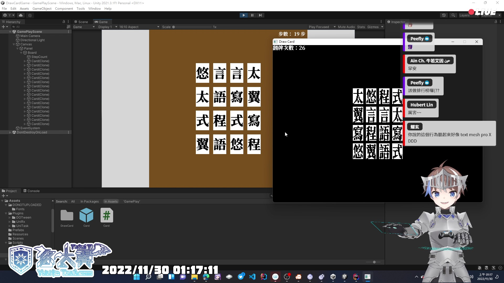

# Unity 遊戲製作實況：悠太翻牌趣

一個在[實況直播](https://yutaii.run/v/319)中製作出來的翻牌遊戲。

## 遊玩方式
進入[網頁](https://yuuta-tsubasa.studio/DrawCardGameUnity)即可遊玩。

## 專案說明

### 使用 Unity 版本
2021.3.1f1

### 使用外掛技術
- [UniTask](https://github.com/Cysharp/UniTask)
- [UniRx](https://github.com/neuecc/UniRx)
- [DOTween](http://dotween.demigiant.com/)

### 素材提供（未上傳，需自行找素材替代或自行去下載）
- 字體：[獅尾B2加糖宋體Swei Sugar](https://github.com/max32002/swei-b2-sugar)

## 作者
- [悠太翼 @YuutaTsubasa](http://yutaii.run/twitter)
- 歡迎訂閱我的 [Youtube 頻道](http://yutaii.run/youtube)！
- 有任何想要修改的部分歡迎發 Pull Request、發 Issue 或是私訊唷！